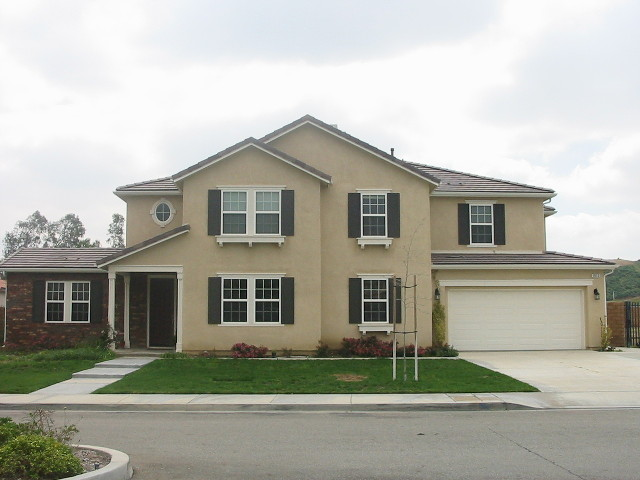
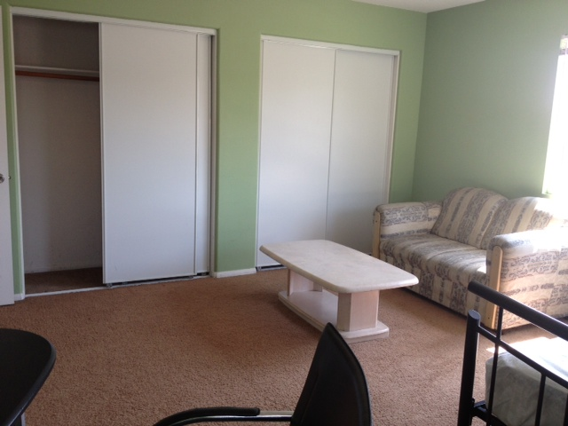

  <!-- Indicators -->
  <ol class="carousel-indicators">
    <li data-target="#carousel-example-generic" data-slide-to="0" class="active"></li>
    <li data-target="#carousel-example-generic" data-slide-to="1"></li>
    <li data-target="#carousel-example-generic" data-slide-to="2"></li>
  </ol>

  <!-- Wrapper for slides -->
  

    

      
      

        Photo 2
      

    

    

      
      

        Photo 3
      

    

    

      
      

        Photo 4
      

    

  

  <!-- Controls -->
  <a class="left carousel-control" href="#carousel-example-generic" data-slide="prev">
    
  </a>
  <a class="right carousel-control" href="#carousel-example-generic" data-slide="next">
    
  </a>

